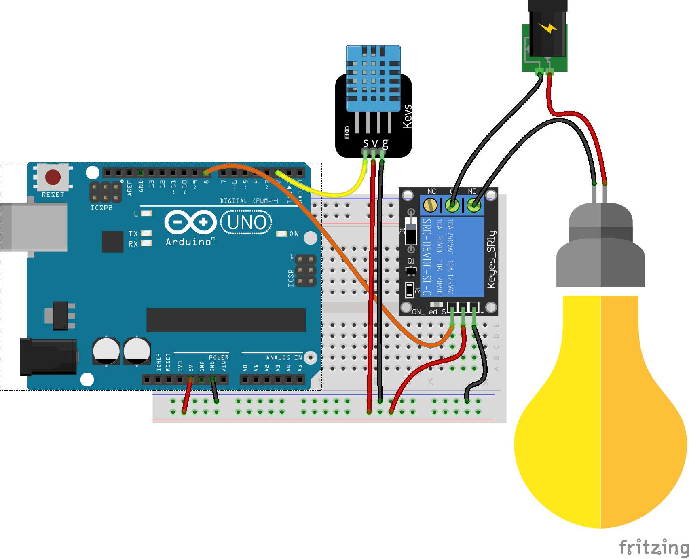
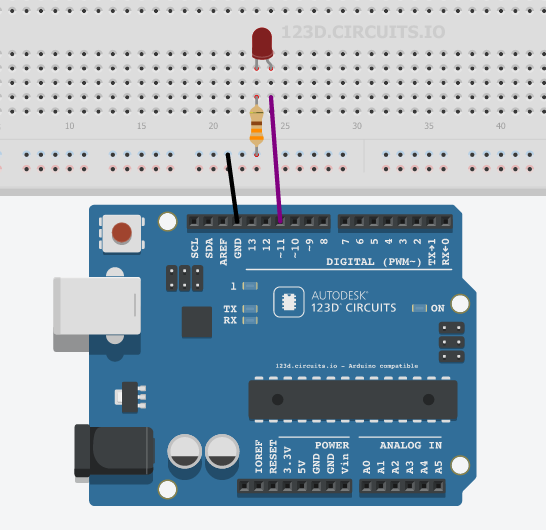
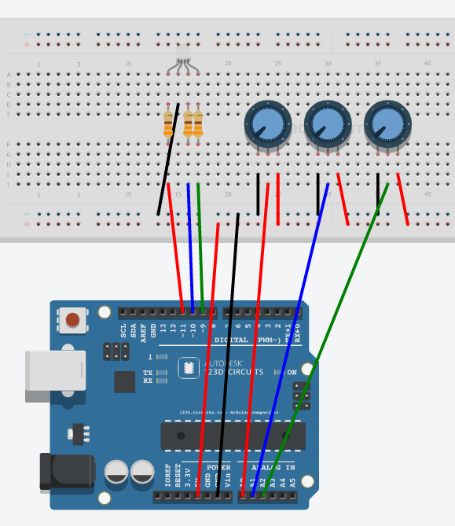
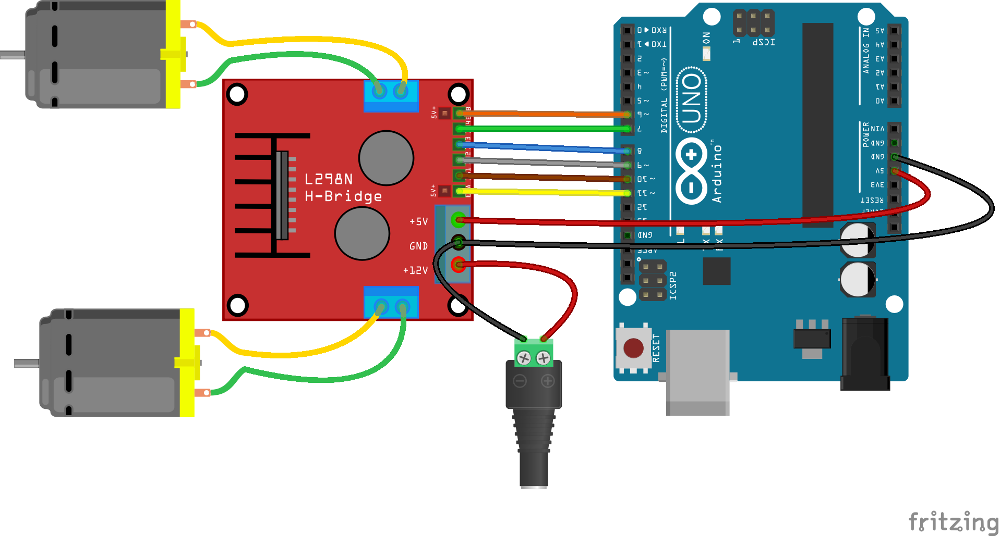
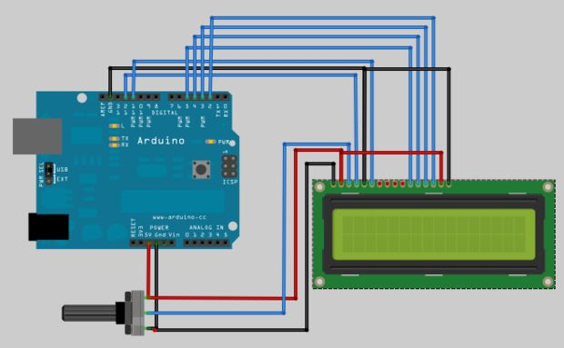
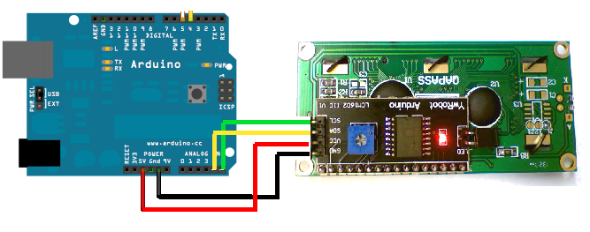
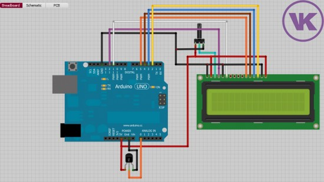

# Ejemplos

## Lectura de sensor DHT11

Empezamos usando el sensor de temperatura y humedad atomosférica DHT11

¿Cómo es que podemos usar esos sensores? : Librerías: conjunto de código empaquetado

Ejemplo: [lcd](http://arduino.cc/en/pmwiki.php?n=Reference/LiquidCrystal) o [servo](http://arduino.cc/en/pmwiki.php?n=Reference/Servo)

### Para incluir una librería en código hacemos

	#include <Libreria.h>


Instalamos la librería **SimpleDHT** (Programa->Librerías->Gestor de librerías)

Las librerías además del código suelen traer ejemplos

Abrimos el ejemplo **DHT11Default** y conectamos el sensor DHT al pin 2


Los datos de temperatura y humedad se envían por el puerto USB al PC

# Envío de datos serie

### La comunicación serie se produce via USB entre Arduino y el PC

* Detectamos el puerto
* Necesitamos un programa para ver los datos, podemos usar el **Monitor Serie** incluído en el IDE de Arduino (Herramientas->Monitor Serie o el botón de la lupa arriba a la derecha)
* Configuramos la velocidad (en este ejemplo 115200)

## Termostado con sensor DHT11

Instalamos la librería SimleDHT (desde el gestor de librerías) y a partir del Ejemplo DHT11Defautl creamos un termostado que activará un relé conectado al pin 8



[Ejemplo con C++](https://github.com/javacasm/ArduinoAvanzadoMotril/blob/master/codigo/TermostatoDHT11/TermostatoDHT11.ino)

[Ejemplo con arduinoblocks](https://github.com/javacasm/ScratchArduinoMotril/blob/master/arduinoBlocks.md#midiendo-calculando-controlando)

# Lectura de datos analógicos

## Potenciómetro: resistencia variable (mando de volumen)

### Se leen valores enteros entre 0 y 1023
### Equivalen a los valores de 0V y 5V


Vamos a utilizar nuestro potenciómetro para seleccionar la temperatura objetivo

En muchas ocasiones necesitamos hacer la transformación al rango que a nosotros nos interesa. Para simplificarlo usamos la función matemática **map**

Convertiremos (mapearemos) la medida de entre 0 y 1023 a una temperatura entre 10º y 30º 


[Programa C++]()
[Programa ArduinoBlocks](http://www.arduinoblocks.com/web/project/192734)


# Números decimales

Usaremos el tipo de variable float

### Ejemplo: Voltímetro
* Leemos el valor de un potenciómetro conectado a una entrada analógica (A0)
* Convertimos el valor (0-1023) a 0 - 5.0v
* Sacamos el valor por la consola serie

* Calibramos viendo los extremos y el valor intermedio 3.3V


	const int analogInPin = A0;  // Entrada analógica
	int sensorValue = 0;        // valor leído

	void setup() {
	  Serial.begin(9600);
	}
	void loop() {

	  sensorValue = analogRead(analogInPin);   // leemos el valor analógico
	  float voltios=(5.0*sensorValue) /1023;   // Lo convertimos
	  Serial.print("sensor = " );                       
	  Serial.print(sensorValue);    
	  Serial.print(" = ");
	  Serial.print(voltios);
	  Serial.println("v");   
	   delay(200);                     
	}

* * *
# Escritura de valores analógicos

## Usando técnicas como PWM podemos simular valores intermedios: 0 - 255
### (sólo en algunos pines ~ )

## Como vamos a hacer que cambie de valor usaremos una variable




### Si vemos el código

	void setup()						// configuracion
	{
	  pinMode(11,OUTPUT);				// Usaremos la patilla 11 como salida

	}

	void loop()
	{
	  int contador=0;				// la variable valorSalida empieza en 0
	  while (contador <= 255) {		// Haremos el bucle hasta que lleguemos a 256
	    analogWrite(11,contador);		// pasamos el valor a la patilla 11
	    delay(100);						// Esperamos 0,1 segundos
	   }

	}

## Vamos a hacer ahora una subida y luego la bajada


Es importante el dar un valor válido a la variable contador hasta de empezar a bajar

Ejercicio:Añade una línea para que veas el valor desde el PC.

Piensa en qué cambia si lo pones antes o después del incremento de la variable

* * *
# Led RGB
## 3 leds (Red,Green,Blue) con una de las patillas común

## Positivo (Ánodo) Común


## Negativo (Cátodo) Común


## Tiras de leds: Necesitamos más potencia por lo que usaremos un transistor como amplificador.

### El montaje es sencillo


[Introducción a la electrónica](http://www.slideshare.net/javacasm/40-introduccin-a-la-electrnica)

Un simple transistor Mosfet nos permite controlar grandes potencias

TODO!!!


#### Ejercicios: Combinando colores

Vamos a hacer combinaciones de colores.
Definiremos funciones con distintos colores y haremos una secuencia de colores. Cada función llamar
Es muy importante que seamos claros con los nombres de las variables para así no equivocarnos

* * *
# Potenciómetro regulando una salida analógica


### El código:

	void setup()
	{
	  pinMode(5,OUTPUT);
	}


	void loop()
	{
	  int valorPotenciometro=analogRead(0);				 	// Leemos el valor
	  int ValorSalida=map(valorPotenciometro,0,1023,0,255);	// Convertimos al rango de salida
	  analogWrite(5,ValorSalida);							// Escribimos el valor en la salida
	}

### Ejercicio: usar 3 potenciómetros para controlar los colores de un led RGB

El montaje sería:




# Motores

Para controlar motores vamos a usar una placa especializada que usa el conocido controlador L298



Esta placa es capaz de controlar 2 motores de hasta 2A cada uno.

Comentar el tema de alimentación y la forma de controlarlo **Alimentación**

Esta placa, de tipo shield, se conecta encima de arduino y usa unos pines concretos:

|Entrada|pin|Utilidad|
|---|---|---|
|EB|5| Velocidad de giro del motor 2|
|I4|7| Sentido de giro del motor 2|
|I3|8| Sentido de giro del motor 2|
|I2|9| Sentido de giro del motor 1|
|I1|10| Sentido de giro del motor 1|
|EA|11| Velocidad de giro del motor 1|

Resaltar que hemos usado los pines PWM 11 y 5 para controlar la velocidad

## Código

	//Arduino PWM Speed Control：
	int E1 = 5;  
	int M1 = 4;
	int E2 = 6;                      
	int M2 = 7;                        

	void setup()
	{
	    pinMode(M1, OUTPUT);   
	    pinMode(M2, OUTPUT);
	}

	void loop()
	{
	  int value;
	  for(value = 0 ; value <= 255; value+=5)
	  {
	    digitalWrite(M1,HIGH);   
	    digitalWrite(M2, HIGH);       
	    analogWrite(E1, value);   //PWM Speed Control
	    analogWrite(E2, value);   //PWM Speed Control
	    delay(30);
	  }  
	}
* * *
# Servo

### Los servos son motores capaces de mantener una posición angular.
### Se les dice él ángulo que deben formar

##### (también hay servos que pueden girar todo lo que quieran)


* * *


### El código

	#include <Servo.h>  // Incluimos la librería

	Servo servo;       // Declaramos que vamos a usar 1 servo

	void setup()
	{
	  servo.attach(7); // Configuramos el servo conectado al pin 7
	}


	void loop()
	{
	  int valorPotenciometro=analogRead(A0); 					// Leemos el potenciometro
	  int PosicionServo=map(valorPotenciometro,0,1023,0,180);	// Reescalamos el valor
	  servo.write(valorPotenciometro);							// Le pedimos que gira hasta ese ángulo
	  delay(50);												// Le damos tiempo para que complete el giro

}
## Oscilación servo

Podemos utilizar un bucle para hacer que el servo oscile entre las posiciones extremas


#### [Más sobre servos](http://www.slideshare.net/javacasm/arduino-prctico-servos)

* * *

# LCD



### Existen varias librerías:

* [Librería LCD MF](https://bitbucket.org/fmalpartida/new-liquidcrystal/wiki/Home)
* [Ejemplos lcd](http://arduino-info.wikispaces.com/LCD-Blue-I2C#v3)
* [Ejemplo bq](http://diwo.bq.com/programando-lcd/)

### Usaremos lcd I2C

* Descargamos de su [origen](http://www.4tronix.co.uk/arduino/sketches/LiquidCrystal_V1.2.1.zip)
* Descomprimimos en la carpeta **arduino/libraries**

### Montaje



### Código

	#include <Wire.h>
	#include <LiquidCrystal.h>

	LiquidCrystal lcd(0x27);  // El fabricante nos debe decir la dirección

	void setup()
	{
	  lcd.begin(16, 2);  //Geometria del lcd
	  lcd.clear();

	}


	void loop()
	{
	  lcd.setCursor(0,0);  		// Nos movemos a la posición
	  lcd.print("Hola Mundo");	// Mostramos un texto

	}

* * *
# Proyecto: termostato configurable y que activa un relé

[Proyecto 1](https://arduinolab.wordpress.com/)


[Proyecto 2](http://www.electroschematics.com/8998/arduino-temperature-controlled-relay/)


## Veamos los componentes:

* Sensor lm35 conectado a A0
* Potenciómetro conectado a A1
* Relé conectado a D7
* LCD conectado a A4 y A5

## Programa

Comparamos el valor leido del potenciómetro con el leído del potenciómetro.
Si este es máyor activamos el relé
Mostramos en el lcd la temperatura actual


## LCD I2C

[Hello World](https://github.com/javacasm/ArduinoAvanzadoMotril/blob/master/codigo/LCDHelloWorld/LCDHelloWorld.ino)


```C++
/*
* ESP8266 with 16x2 I2C LCD
* Compatible with the Arduino IDE 1.6.6
* A fork from https://github.com/agnunez/ESP8266-I2C-LCD1602

www.hobbytronics.com.pk
https://blog.hobbytronics.com.pk
*/

#include <Wire.h>
#include <LiquidCrystal_I2C_ESP.h>

// Set the LCD address to 0x27 for a 16 chars and 2 line display
LiquidCrystal_I2C_ESP lcd(0x3F, 16, 2);

void setup()
{
// initialize the LCD
lcd.begin(21,22);  // sda=21 ,  scl=22

// Turn on the blacklight and print a message.
lcd.backlight();
lcd.print("Hola, mundo!");
}

void loop()
{
    // Do nothing here...
}
```

[Librería](https://github.com/javacasm/ArduinoAvanzadoMotril/blob/master/codigo/ESP8266-I2C-LCD1602.zip)
