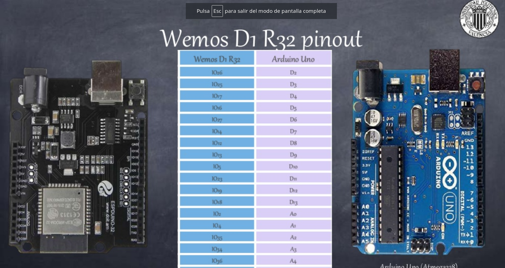
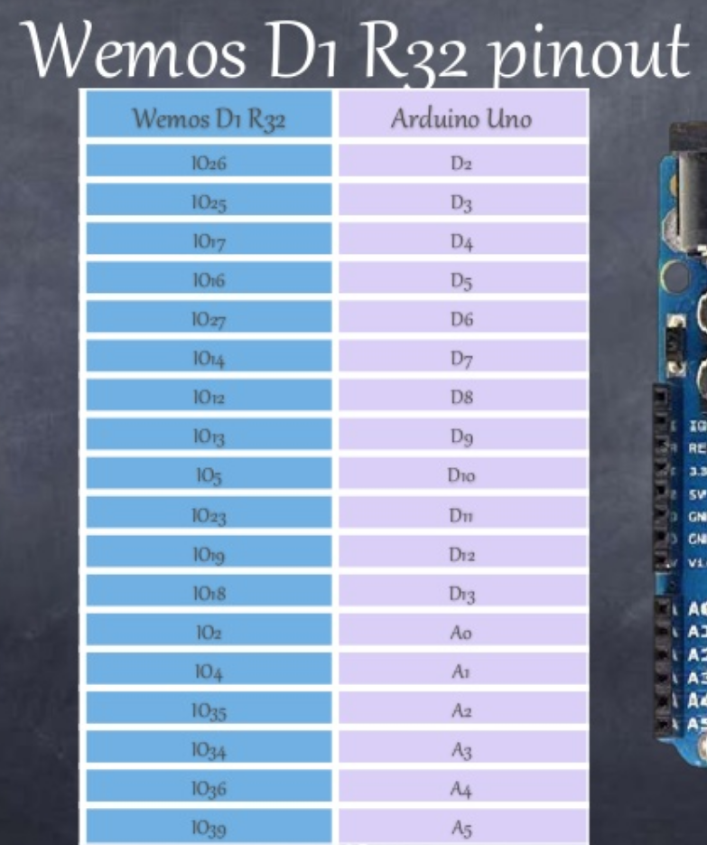
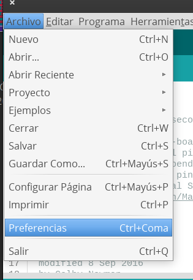
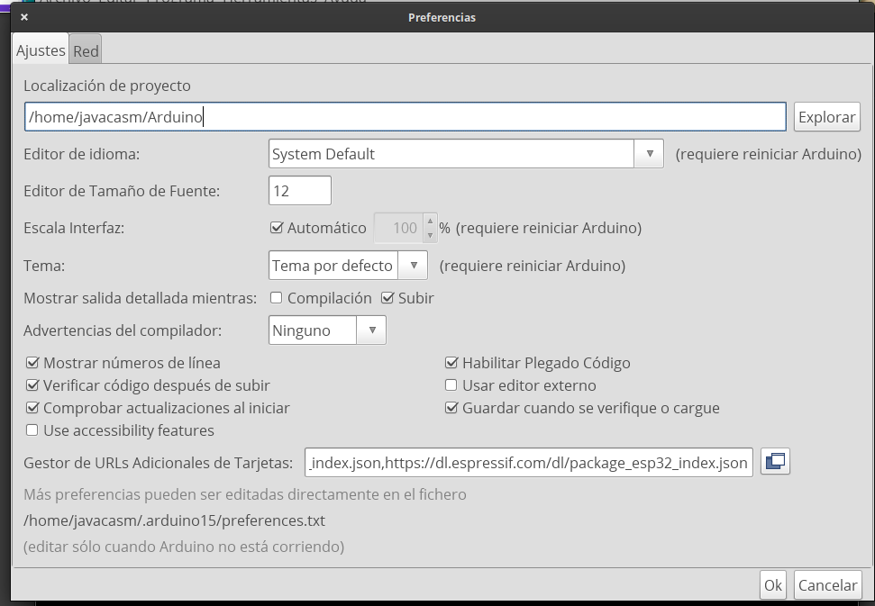

## ESP32


```
CPU: Xtensa dual-core 32-bit LX6 microprocessor 160 o 240 MHz hasta 600 DMIPS
Ultra low power (ULP) co-processor
Memoria: 520 KiB SRAM
Wi-Fi: 802.11 b/g/n
Bluetooth: v4.2 BR/EDR and BLE
12-bit SAR ADC en 18 canales
2 × 8-bit DACs
10 × sensores capacitivos GPIOs
4 × SPI
2 × I²S interfaces
2 × I²C interfaces
3 × UART
SD/SDIO/CE-ATA/MMC/eMMC 
SDIO/SPI slave 
Ethernet MAC con DMA 
CAN bus 2.0
Controlador Infrarrojo (TX/RX, en 8 canales)
Motor PWM
LED PWM (up to 16 channels)
Sensor de efecto Hall 
Ultra low power analog pre-amplifier
```

[Más detalles](http://kio4.com/arduino/100_Wemos_ESP32.htm)

## Correspondencia Arduino UNO - [Wemos D1 R32](https://solectroshop.com/product-spa-1993-Wemos-D1-ESP32-R32-WROOM-32-WiFi-y-Bluetooth.html)

```
Alimentación: 5-12VDC
WiFi 802.11 b/g/n/e/i (802.11n hasta 150 Mbps)
Bluetooth v4.2 BR/EDR y BLE.
Compatible con shields de Arduino Uno.
6 Entrada analógica.
20 Entradas/Salidas digitales (3.3V) (con funciones PWM, interrupción).
Comunicación UART, SPI, I2C.
Tamaño: 68×53 mm
Conexión micro USB.
4Mbytes Flash Memoria 520Kb
Reloj: 240Mhz (un núcleo dedicado al procesaro WiFi)
Temperatura: -40C+85C
Corriente: 250mA (max)
Corriente en modo ahorro: 0.15mA
Corriente de funcionamiento: 20mA (sin WiFi)
```




Imágenes cortesía de 
[Leopoldo Armesto Ángel](https://www.slideshare.net/LeopoldoArmestongel), Lecturer at Universitat Politècnica de València (UPV)

## Configuración del IDE de Arduino

En Preferencias


Añadimos la direccion del paquete de hardware de Espressif 

```
https://dl.espressif.com/dl/package_esp32_index.json
```



Ahora en gestor de tarjetas 


buscamos **ESP32**


Y lo instalamos.

Ahora podremos seleccionar las placas de tipo **ESP32**

Aunque no viene nuestra placa, podemos seleccionar una compatible: **DOIT ESP32 DEVKIT V1**


## Driver

[Drivers para CH341 en windows](http://kio4.com/arduino/imagenes/ch341ser_win.zip)

## Ejemplos

El ejemplo blink funcionará 

¿Qué ejemplos encontramos?


## Ejemplos

[Pines](https://randomnerdtutorials.com/esp32-pinout-reference-gpios/)

### PWM

[PWM](https://randomnerdtutorials.com/esp32-pwm-arduino-ide/)


### ADC

[ADC](https://randomnerdtutorials.com/esp32-adc-analog-read-arduino-ide/)

## Referencias

[Configuracion del IDE](https://www.hackster.io/uncle-yong/wemos-r32-with-arduino-startup-guide-7bc841)

[Tutorial](http://kio4.com/arduino/100_Wemos_ESP32.htm)

[ESP32 spec sheet](https://www.espressif.com/sites/default/files/documentation/esp32_datasheet_en.pdf)

[ESP32 WROOM spec sheet](https://www.espressif.com/sites/default/files/documentation/esp32-wroom-32_datasheet_en.pdf)

[ESP32 (wikipedia)](https://en.wikipedia.org/wiki/ESP32)

[Smart ESP32 Car](https://github.com/javacasm/SmartESP32Car)
