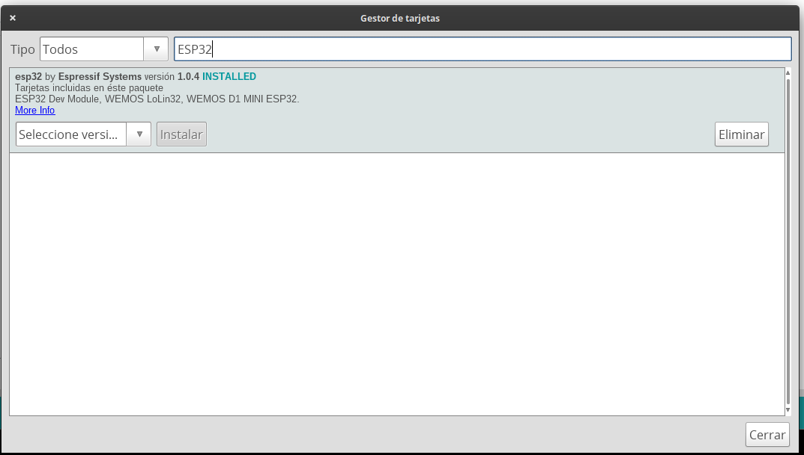
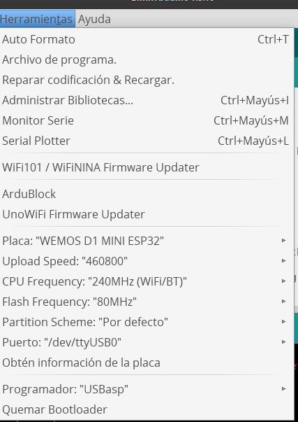

## ESP32


```
CPU: Xtensa dual-core (or single-core) 32-bit LX6 microprocessor, operating at 160 or 240 MHz and performing at up to 600 DMIPS
Ultra low power (ULP) co-processor
Memory: 520 KiB SRAM
Wireless connectivity:
Wi-Fi: 802.11 b/g/n
Bluetooth: v4.2 BR/EDR and BLE
Peripheral interfaces:
12-bit SAR ADC up to 18 channels
2 × 8-bit DACs
10 × touch sensors (capacitive sensing GPIOs)
4 × SPI
2 × I²S interfaces
2 × I²C interfaces
3 × UART
SD/SDIO/CE-ATA/MMC/eMMC host controller
SDIO/SPI slave controller
Ethernet MAC interface with dedicated DMA and IEEE 1588 Precision Time Protocol support
CAN bus 2.0
Infrared remote controller (TX/RX, up to 8 channels)
Motor PWM
LED PWM (up to 16 channels)
Hall effect sensor
Ultra low power analog pre-amplifier
```

## Correspondencia Arduino UNO - Wemos D1 R32


Imágenes cortesía de 
[Leopoldo Armesto Ángel](https://www.slideshare.net/LeopoldoArmestongel), Lecturer at Universitat Politècnica de València (UPV)

## Configuración del IDE de Arduino

En Preferencias


Añadimos la direccion del paquete de hardware de Espressif 

```
https://dl.espressif.com/dl/package_esp32_index.json
```


Ahora en gestor de tarjetas 


buscamos **ESP32**



Y lo instalamos.

Ahora podremos seleccionar las placas de tipo **ESP32**

Aunque no viene nuestra placa, podemos seleccionar una compatible: **DOIT ESP32 DEVKIT V1**




## Ejemplos

El ejemplo blink funcionará 

¿Qué ejemplos encontramos?


## Referencias

[Smart ESP32 Car](https://github.com/javacasm/SmartESP32Car)

[Configuracion del IDE](https://www.hackster.io/uncle-yong/wemos-r32-with-arduino-startup-guide-7bc841)

[Tutorial](http://kio4.com/arduino/100_Wemos_ESP32.htm)

[ESP32 spec sheet](https://www.espressif.com/sites/default/files/documentation/esp32_datasheet_en.pdf)

[ESP32 WROOM spec sheet](https://www.espressif.com/sites/default/files/documentation/esp32-wroom-32_datasheet_en.pdf)

[ESP32 (wikipedia)](https://en.wikipedia.org/wiki/ESP32)
