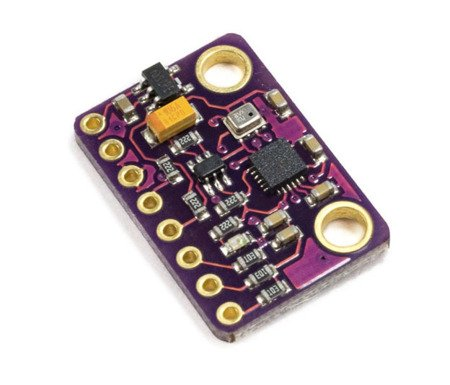
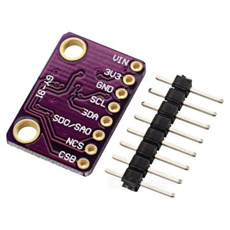

# Sensores

## GY91 = MPU9250 + BMP280

[Producto](https://solectroshop.com/product-spa-1546-GY-9110DOF-4-Sensores-en-1-Modulo-con-MPU-9250-y-BMP280.html)

## Documentacion

- Voltaje de funcionamiento: 3 - 5 VDC (regulador de baja caída integrado)
- Modelo: GY-91
- Chips principales:
- MPU-9250: sensor digital MEMS 9 ejes
- BMP280: sensor digital de temperatura, humedad y presión
- Interfaz: protocolo de comunicaciones estándar I2C/SPI
- Resolución: convertidor A/D de 16 bits, datos de 16 bits en salida
- Gama de giroscopios: ± 250, 500, 1000, 2000°/s
- Rango de campo: ± 4800 uT
- Rango de presión: 300-1100hPa
- Usa la inmersión Gold PCB, proceso de soldadura asegurando la calidad
- Número de pines: 8
- VIN: Voltaje de alimentación
- 3V3: Salida 3.3V del regulador
- GND: Conexión a tierra
- SCL: Reloj I2C / Reloj SPI
- SDA: Datos I2C o entrada de datos SPI
- SDO/SAO: Salida de datos SPI / Pin de configuración de dirección esclava I2C
- NCS: Chip seleccionado para el modo SPI sólo para el chip MPU-9250
- CSB: Chip seleccionado para BMP280

## Referencia

https://github.com/ricardozago/GY91-MPU9250-BMP280

https://github.com/TheChapu/GY-91
