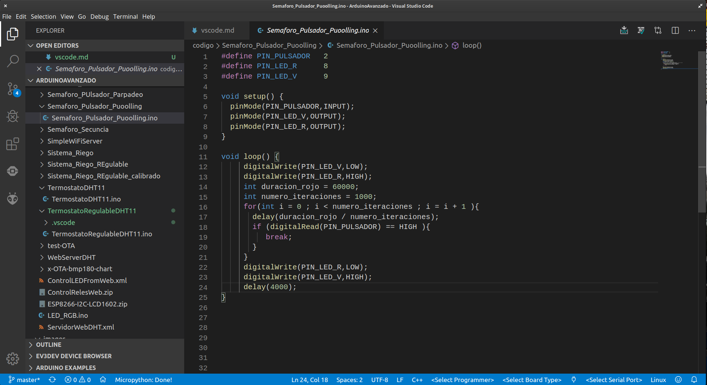

# Visual Studio Code

Entorno de programación OpenSource de Microsoft

Permite programar con diferente lenguajes: Python, C, C++, Java, arduino, ... incluso usando diferentes plataformas, por ejemplo Arduino con Plataform IO o herramientas de programación para Lego. Además integra herramientas de gestión de código como git y de depuración.

Para usar diferentes lenguajes y/o plataformas usaremos extensiones

Está disponible para los sistemas operativos más frecuentes

## Instalación

[Descarga](https://code.visualstudio.com/download)

Lo instalamos y procedemos a buscar las extensiones.

Pulsamos el icono de las extensiones 

Y buscamos la extensión de **Arduino**. Yo uso la primera opción que es una extensión creada por Microsoft

## Uso

En lugar de utilizar muchas barras de iconos, para acceder a las diferentes funcionalidades Pulsamos **F1** o **ctrl + shift + P** y buscamos la opción que queremos usar, poniendo en primer lugar la extensión. 
